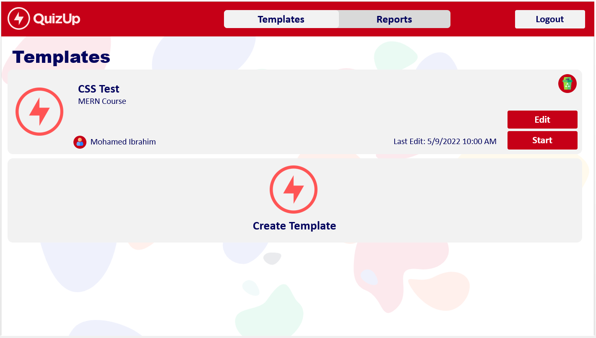

# Capstone 1 - Interactive Polling App:

# Before you start
- We want you to include two `README.md` files, one for Backend and one for Frontend
    - The backend file should have information about the endpoints (with request type) and parameters that each endpoint accepts.  
    - Backend should also mention any headers expected for any endpoint. You should be writing the Readme file for other developers who might use your backend code.
    - For Frontend, mention how to build the project, and deployment instructions
    - Mention the features of the frontend and include the screenshots of the screens as well.
     
- We want you to keep track of time in a `Timesheet.md` file. You can have this file in root of `Backend`, here is a sample entry in the time sheet file.
Below each milestone entry also add the estimated time you think you will take to finish that milestone.

```
## Milestone 1
Estimated time: 5hrs
### Part 1
    19 Jul '21 
    13:53 - 14:35: Working on the login and signup API 
    15:00 - 17:00: Working on the login and signup API
    --------------
    20 Jul '21
    09:30 - 09:48: Working on the frontend for Signup and Login 
    09:57 - 10:50: Working on the frontend for Signup and Login

Part 1 completed in around 3 hours 30mins.

### MISC
23 Jul '21
11.30 - 13.00: Fixed some bugs and UI issues as per the feedback
```

## Description
You are asked to create an application that follows the blended learning techniques. This application will be used in live physical and online sessions. The target of this application is to transform the normal bored sessions into interactive one. This will enable the presenter to interact with his audience in a funny yet systematic way during the session. There are two types of users: 

- Presenter (For instance, teacher)
- Audience (For instance, students)  

# User Stories for every user:

## Teacher:

- The teacher should be able to sign in or sign up as shown in the following screens: 


- The teacher can view all the quiz templates that has been created by him as shown in the following screens:



- The teacher can create a quiz by adding two types of questions, 'Choice Question' and 'True/False Question'. The teacher can add the 'question text', 'image', 'choices text' and 'mark the correct answer'. The teacher can control the order of the questions that will appear to the audience, or delete them from question preview side bar.


- From this point, the teacher's screen is projected physcally on front of the students if it is a physical session or screen shared if it is an online session. In this requirement, the teacher can chose any template and click the start button. When the teacher starts the session, a game screen will be shown along with unique numeric number that can identify the game session easily. This numeric pin will be used by the students to join the session. Moreover, there is a QR Code generated for every session so that the students can scan the QR Code instead of entering the game pin. 


- When the teacher presses 'Start', the questions will be shown with a timer and each one of the student can see the teacher's screen and can choose the choices from their own device (Phone or Laptop). The question screen will show the 'question text', 'image', 'choices text', 'live statistics about the current chosen choices', and 'timer'. The question screen should appear as follows.


- After the timer finishes, the correct answer should appear along with a next button for the teacher to move to the next question in the quiz as in the following screen.


- After the game session, there will be a dashboard screen showing the attendees with their scoring and they are sorted based on their ranks, and if their ranks are equal, then they are sorted in an alpapetical order as shown in the following screen.


# Students Screens

- Students screens are only for the ones within game session will enter the link for the app and actually write their own pin within the box as shown in the folllowing screen.


- While the question is shown, the answer can be shown as follows.


- If the student has made a choice and the timer didn't finish, this screen should appear to the student.


- When the teacher's timer is finished, there is a review that should be shown to the student till the teacher goes to the next question.


- When the session finishes, there should be a final feedback screen that is shown on the student's screen to explain his rank that is shown on the teacher's screen.


https://kahoot.it/

